# 2. Modèle de données et dictionnaire de données

Ce document décrit la base PostgreSQL `rh_mahajanga` telle qu'elle existe au 5 octobre 2026 (migrations du dossier `server/migrations/`, jusqu'à la 021 incluse). Les tableaux et le diagramme sont générés à partir de la base elle-même, pas recopiés à la main : ils reflètent donc l'état réel, y compris ses écarts.

## 2.1 Conventions

- **Clés primaires** : colonne `id` de type entier auto-incrémenté (séquence PostgreSQL), sauf exceptions signalées dans le dictionnaire.
- **Nommage** : tables et colonnes en français, en minuscules avec underscores.
- **Dates** : `date` pour les jours (ex. `date_debut`), `timestamp` sans fuseau pour les horodatages (`created_at`, `reviewed_at`). Les dates de congé sont saisies et stockées au format AAAA-MM-JJ.
- **Statuts et énumérations** : colonnes `VARCHAR` avec une contrainte `CHECK` (et non un type ENUM PostgreSQL), ce qui permet d'ajouter une valeur par migration simple.
- **Rôles** : pas de table `roles`. Le rôle d'accès est un `CHECK` littéral sur `users.role`. Le fichier `server/database/schema.sql` déclare une table `roles` qui n'existe pas en base : c'est un écart connu, documenté dans `server/database/MCD.md`.
- **Suppression** : deux mécanismes. Les clés étrangères utilisent `CASCADE`, `SET NULL` ou `NO ACTION` selon le cas (voir le dictionnaire). La suppression applicative passe par la table `corbeille`, qui conserve les données supprimées pour restauration (soft delete géré par le code, pas par une colonne `deleted_at`).
- **Historique** : les changements de carrière gardent l'ancienne et la nouvelle situation en `jsonb` (`carriere_evenements`) ; un document officiel garde le snapshot de ses données (`documents_generes.donnees`).

## 2.2 Modèle conceptuel simplifié

Diagramme des entités principales et de leurs liens (généré depuis les clés étrangères) :

```mermaid
erDiagram
    carriere_evenements ||--o{ alertes_avancement : "alertes_avancement_evenement_resultant_id"
    personnel ||--o{ alertes_avancement : "alertes_avancement_personnel_id"
    users ||--o{ alertes_avancement : "alertes_avancement_traite_par"
    users ||--o{ carriere_evenements : "carriere_evenements_created_by"
    lignes_grille_indiciaire ||--o{ carriere_evenements : "carriere_evenements_ligne_grille_id"
    personnel ||--o{ carriere_evenements : "carriere_evenements_personnel_id"
    users ||--o{ carriere_evenements : "carriere_evenements_updated_by"
    users ||--o{ conges : "conges_reviewed_by"
    users ||--o{ conges : "conges_user_id"
    users ||--o{ conges : "conges_validateur_id"
    users ||--o{ conges_droits_annuels : "conges_droits_annuels_created_by"
    personnel ||--o{ conges_droits_annuels : "conges_droits_annuels_personnel_id"
    conges ||--o{ conges_imputations : "conges_imputations_conge_id"
    contrats ||--o{ contrats : "contrats_contrat_precedent_id"
    users ||--o{ contrats : "contrats_created_by"
    personnel ||--o{ contrats : "contrats_personnel_id"
    users ||--o{ contrats : "contrats_updated_by"
    documents_generes ||--o{ demandes_documents : "demandes_documents_document_id"
    personnel ||--o{ demandes_documents : "demandes_documents_personnel_id"
    users ||--o{ demandes_documents : "demandes_documents_traite_par"
    personnel ||--o{ directions : "directions_responsable_personnel_id"
    contrats ||--o{ documents_contrat : "documents_contrat_contrat_id"
    users ||--o{ documents_contrat : "documents_contrat_importe_par"
    users ||--o{ documents_generes : "documents_generes_genere_par"
    personnel ||--o{ documents_generes : "documents_generes_personnel_id"
    grilles_indiciaires ||--o{ lignes_grille_indiciaire : "lignes_grille_indiciaire_grille_id"
    users ||--o{ notifications : "notifications_recipient_id"
    users ||--o{ notifications : "notifications_sender_id"
    lignes_grille_indiciaire ||--o{ personnel : "personnel_ligne_grille_actuelle_id"
    etablissements ||--o{ personnel_pe_infos : "personnel_pe_infos_etablissement_id"
    personnel ||--o{ personnel_pe_infos : "personnel_pe_infos_personnel_id"
    personnel ||--o{ personnel_roles : "personnel_roles_personnel_id"
    permissions ||--o{ role_permissions : "role_permissions_permission_id"
    directions ||--o{ services : "services_direction_id"
    personnel ||--o{ services : "services_responsable_personnel_id"
    users ||--o{ situations_administratives : "situations_administratives_created_by"
    personnel ||--o{ situations_administratives : "situations_administratives_personnel_id"
    types_situation_administrative ||--o{ situations_administratives : "situations_administratives_type_situation_id"
    personnel ||--o{ users : "users_personnel_id"
```

<!-- BEGIN GENERE:MCD -->

<!-- END GENERE:MCD -->

## 2.3 Points de vigilance du modèle

1. **Direction et service en texte.** `personnel.direction` et `personnel.service` sont des `VARCHAR`, pas des clés étrangères vers `directions` et `services`. La cohérence repose sur une cascade de renommage codée dans `organisationRepository` (`updateDirection`, `updateService`). Une écriture qui contournerait ce code créerait un écart silencieux.
2. **Deux sources pour les rôles métier.** `personnel.role` (PE ou PAT, un seul) et `personnel_roles` (plusieurs rôles, migration 018). Les deux doivent rester synchronisés ; la seconde est la référence pour les cumuls.
3. **Trois notions d'indice.** `personnel.indice` (texte saisi ou importé), `personnel.indice_num` (IB, entier, l'indice brut utilisé pour le calcul) et `personnel.chapitre_ib` (chapitre budgétaire, utilisé à tort sur le certificat administratif, voir l'audit). Ce sont trois champs distincts.
4. **Source de chaque indice.** `indice_source` (`IMPORT_EXCEL`, `SAISIE_RH`, `REGLEMENTAIRE`, `A_CONFIRMER`) indique d'où vient la valeur. Un indice `A_CONFIRMER` doit être vérifié avant tout usage officiel.
5. **Congé : statut et étapes.** Sur `conges`, `status` est l'état final (en_attente, approuvee, refusee). `decision_secretariat` et `decision_intermediaire` sont les étapes qui y mènent. Une demande peut être encore `en_attente` alors que l'étape secrétariat est déjà faite.
6. **Accès et désignation.** `users.role` est le rôle d'accès (ce que la personne peut faire). `personnel.secretariat_role` est la désignation RH (la personne est secrétaire). Le compte reprend la désignation à sa création (`registerWithMatricule`).
7. **Données sans clé étrangère.** `conges.remplacant` et `conges.lieu_jouissance` sont du texte libre ; `personnel.poste` et `personnel.fonction` ont une liste de valeurs gérée par la table `fonction_history` et l'interface, pas par une table de référence.

## 2.4 Dictionnaire de données

<!-- BEGIN GENERE:DICTIONNAIRE -->
Le dictionnaire couvre les 36 tables de la base. Pour chacune : sa finalité, ses colonnes (type, obligatoire, valeur par défaut), ses clés et ses contraintes.

### `activity_log`

Journal des actions : qui a fait quoi, et quand.

| Colonne | Type | Obligatoire | Défaut | Remarque |
|---|---|---|---|---|
| `id` | integer | oui | nextval('activity_log_id_seq') | Clé primaire |
| `user_id` | integer | non | — | → users.id |
| `action_type` | character varying(50) | oui | — |  |
| `description` | text | oui | — |  |
| `created_at` | timestamp without time zone | oui | now() |  |

- Clé étrangère `activity_log_user_id_fkey` : FOREIGN KEY (user_id) REFERENCES users(id) ON DELETE SET NULL

### `alertes_avancement`

Alertes générées quand un agent atteint une échéance de carrière. Traitées par la RH (ouverte, traitée ou ignorée).

| Colonne | Type | Obligatoire | Défaut | Remarque |
|---|---|---|---|---|
| `id` | integer | oui | nextval('alertes_avancement_id_seq') | Clé primaire |
| `personnel_id` | integer | oui | — | → personnel.id |
| `type` | character varying(30) | oui | — |  |
| `date_echeance_theorique` | date | non | — |  |
| `statut` | character varying(20) | oui | 'OUVERTE' |  |
| `details` | jsonb | non | — |  |
| `evenement_resultant_id` | integer | non | — | → carriere_evenements.id |
| `created_at` | timestamp without time zone | oui | now() |  |
| `traite_at` | timestamp without time zone | non | — |  |
| `traite_par` | integer | non | — | → users.id |

- Contrôle `alertes_avancement_statut_check` : CHECK (((statut)= ANY ((['OUVERTE', 'TRAITEE', 'IGNOREE']))))
- Contrôle `alertes_avancement_type_check` : CHECK (((type)= ANY ((['AVANCEMENT_ECHELON_ECHU', 'AVANCEMENT_CLASSE_ELIGIBLE', 'INCOHERENCE_INDICE', 'GRILLE_INCONNUE', 'DOSSIER_INCOMPLET']))))
- Clé étrangère `alertes_avancement_evenement_resultant_id_fkey` : FOREIGN KEY (evenement_resultant_id) REFERENCES carriere_evenements(id) ON DELETE SET NULL
- Clé étrangère `alertes_avancement_personnel_id_fkey` : FOREIGN KEY (personnel_id) REFERENCES personnel(id) ON DELETE CASCADE
- Clé étrangère `alertes_avancement_traite_par_fkey` : FOREIGN KEY (traite_par) REFERENCES users(id) ON DELETE SET NULL

### `carriere_evenements`

Historique de carrière : chaque événement (recrutement, avancement, reclassement, retraite…) avec l'ancienne et la nouvelle situation.

| Colonne | Type | Obligatoire | Défaut | Remarque |
|---|---|---|---|---|
| `id` | integer | oui | nextval('carriere_evenements_id_seq') | Clé primaire |
| `personnel_id` | integer | oui | — | → personnel.id |
| `type_evenement` | character varying(50) | oui | — |  |
| `description` | text | non | — |  |
| `date_evenement` | date | oui | — |  |
| `created_by` | integer | non | — | → users.id |
| `created_at` | timestamp without time zone | oui | now() |  |
| `date_effet` | date | non | — |  |
| `ancienne_situation` | jsonb | non | — |  |
| `nouvelle_situation` | jsonb | non | — |  |
| `corps` | character varying(20) | non | — |  |
| `grade` | character varying(100) | non | — |  |
| `classe` | character varying(50) | non | — |  |
| `echelon` | character varying(50) | non | — |  |
| `indice` | character varying(50) | non | — |  |
| `fonction` | character varying(50) | non | — |  |
| `affectation` | character varying(150) | non | — |  |
| `motif` | text | non | — |  |
| `reference_decision` | character varying(150) | non | — |  |
| `autorite_decision` | character varying(150) | non | — |  |
| `observations` | text | non | — |  |
| `justificatif_filename` | character varying(255) | non | — |  |
| `justificatif_path` | character varying(255) | non | — |  |
| `updated_by` | integer | non | — | → users.id |
| `updated_at` | timestamp without time zone | non | — |  |
| `ligne_grille_id` | integer | non | — | → lignes_grille_indiciaire.id |
| `indice_num` | integer | non | — |  |
| `indice_source` | character varying(20) | oui | 'A_CONFIRMER' |  |

- Contrôle `carriere_evenements_indice_source_check` : CHECK (((indice_source)= ANY ((['IMPORT_EXCEL', 'SAISIE_RH', 'REGLEMENTAIRE', 'A_CONFIRMER']))))
- Contrôle `carriere_evenements_type_evenement_check` : CHECK (((type_evenement)= ANY (['Recrutement', 'Stage', 'Titularisation', 'Prolongation de stage', 'Avancement d''échelon', 'Avancement de grade', 'Reclassement', 'Changement de fonction', 'Changement d''affectation', 'Changement de service', 'Mise à disposition', 'Détachement', 'Disponibilité', 'Formation ou diplôme', 'Changement de qualification', 'Avenant au contrat', 'Renouvellement de contrat', 'Suspension ou événement disciplinaire', 'Retraite', 'Fin de contrat', 'Cessation définitive de fonctions', 'Réintégration', 'Autre'])))
- Clé étrangère `carriere_evenements_created_by_fkey` : FOREIGN KEY (created_by) REFERENCES users(id) ON DELETE SET NULL
- Clé étrangère `carriere_evenements_ligne_grille_id_fkey` : FOREIGN KEY (ligne_grille_id) REFERENCES lignes_grille_indiciaire(id) ON DELETE SET NULL
- Clé étrangère `carriere_evenements_personnel_id_fkey` : FOREIGN KEY (personnel_id) REFERENCES personnel(id)
- Clé étrangère `carriere_evenements_updated_by_fkey` : FOREIGN KEY (updated_by) REFERENCES users(id) ON DELETE SET NULL

### `categories_professionnelles`

Catégories professionnelles (CAT1 à CAT8) et leur appellation.

| Colonne | Type | Obligatoire | Défaut | Remarque |
|---|---|---|---|---|
| `id` | integer | oui | nextval('categories_professionnelles_id_seq') | Clé primaire |
| `numero` | integer | oui | — |  |
| `code` | character varying(10) | oui | — |  |
| `appellation` | character varying(100) | oui | — |  |
| `niveau_diplome` | character varying(100) | non | — |  |

- Contrôle `categories_professionnelles_numero_check` : CHECK ((((numero >= 1) AND (numero <= 8)) AND (numero <> 7)))

### `conges`

Demandes de congé et leur circuit : vérification du secrétariat, avis du responsable direct, décision RH.

| Colonne | Type | Obligatoire | Défaut | Remarque |
|---|---|---|---|---|
| `id` | integer | oui | nextval('conges_id_seq') | Clé primaire |
| `user_id` | integer | oui | — | → users.id |
| `type_conge` | character varying(50) | oui | — |  |
| `date_debut` | date | oui | — |  |
| `date_fin` | date | oui | — |  |
| `motif` | text | non | — |  |
| `status` | character varying(20) | oui | 'en_attente' |  |
| `reviewed_by` | integer | non | — | → users.id |
| `reviewed_at` | timestamp without time zone | non | — |  |
| `created_at` | timestamp without time zone | oui | now() |  |
| `avis_chef_service` | text | non | — |  |
| `lieu_jouissance` | character varying(150) | non | — |  |
| `date_reprise_service` | date | non | — |  |
| `remplacant` | character varying(150) | non | — |  |
| `validateur_id` | integer | non | — | → users.id |
| `decision_intermediaire` | character varying(20) | oui | 'non_requise' |  |
| `decision_intermediaire_le` | timestamp without time zone | non | — |  |
| `justificatif_filename` | character varying(255) | non | — |  |
| `justificatif_path` | character varying(255) | non | — |  |
| `solde_avant` | numeric(6,1) | non | — |  |
| `solde_apres` | numeric(6,1) | non | — |  |
| `decision_secretariat` | character varying(20) | oui | 'en_attente' |  |
| `decision_secretariat_le` | timestamp without time zone | non | — |  |
| `avis_secretariat` | text | non | — |  |

- Contrôle `conges_check` : CHECK ((date_fin >= date_debut))
- Contrôle `conges_decision_intermediaire_check` : CHECK (((decision_intermediaire)= ANY ((['en_attente', 'approuvee', 'refusee', 'non_requise']))))
- Contrôle `conges_decision_secretariat_check` : CHECK (((decision_secretariat)= ANY ((['en_attente', 'approuvee', 'refusee']))))
- Contrôle `conges_status_check` : CHECK (((status)= ANY ((['en_attente', 'approuvee', 'refusee']))))
- Contrôle `conges_type_conge_check` : CHECK (((type_conge)= ANY ([('Congé annuel'), ('Permission'), ('Autorisation d''absence'), ('Congé de maternité'), ('Congé de paternité'), ('Congé de maladie'), ('Formation'), ('Autres')])))
- Clé étrangère `conges_reviewed_by_fkey` : FOREIGN KEY (reviewed_by) REFERENCES users(id) ON DELETE SET NULL
- Clé étrangère `conges_user_id_fkey` : FOREIGN KEY (user_id) REFERENCES users(id) ON DELETE CASCADE
- Clé étrangère `conges_validateur_id_fkey` : FOREIGN KEY (validateur_id) REFERENCES users(id) ON DELETE SET NULL

### `conges_droits_annuels`

Droits de congé acquis par année (2,5 jours par mois de service effectif).

| Colonne | Type | Obligatoire | Défaut | Remarque |
|---|---|---|---|---|
| `id` | integer | oui | nextval('conges_droits_annuels_id_seq') | Clé primaire |
| `personnel_id` | integer | oui | — | → personnel.id |
| `annee` | integer | oui | — |  |
| `libelle_periode` | character varying(20) | non | — |  |
| `droit` | numeric(6,1) | oui | — |  |
| `source` | character varying(12) | oui | 'CALCULE' |  |
| `reference` | character varying(255) | non | — |  |
| `created_by` | integer | non | — | → users.id |
| `created_at` | timestamp without time zone | oui | now() |  |

- Contrôle `conges_droits_annuels_annee_check` : CHECK (((annee >= 1950) AND (annee <= 2200)))
- Contrôle `conges_droits_annuels_droit_check` : CHECK ((droit >= (0)))
- Contrôle `conges_droits_annuels_source_check` : CHECK (((source)= ANY ((['CALCULE', 'OUVERTURE']))))
- Clé étrangère `conges_droits_annuels_created_by_fkey` : FOREIGN KEY (created_by) REFERENCES users(id) ON DELETE SET NULL
- Clé étrangère `conges_droits_annuels_personnel_id_fkey` : FOREIGN KEY (personnel_id) REFERENCES personnel(id) ON DELETE CASCADE

### `conges_historiques`

Congés pris avant l'arrivée dans SGRH, repris pour le calcul du solde.

| Colonne | Type | Obligatoire | Défaut | Remarque |
|---|---|---|---|---|
| `id` | integer | oui | nextval('conges_historiques_id_seq') | Clé primaire |
| `personnel_id` | integer | oui | — | → personnel.id |
| `annee` | integer | oui | — |  |
| `date_debut` | date | oui | — |  |
| `date_fin` | date | oui | — |  |
| `jours` | numeric(6,1) | oui | — |  |
| `reference` | character varying(255) | non | — |  |
| `created_by` | integer | non | — | → users.id |
| `created_at` | timestamp without time zone | oui | now() |  |
| `lieu_jouissance` | character varying(150) | non | — |  |

- Contrôle `conges_historiques_annee_check` : CHECK (((annee >= 1950) AND (annee <= 2200)))
- Contrôle `conges_historiques_dates_check` : CHECK ((date_fin >= date_debut))
- Contrôle `conges_historiques_jours_check` : CHECK ((jours > (0)))
- Clé étrangère `conges_historiques_created_by_fkey` : FOREIGN KEY (created_by) REFERENCES users(id) ON DELETE SET NULL
- Clé étrangère `conges_historiques_personnel_id_fkey` : FOREIGN KEY (personnel_id) REFERENCES personnel(id) ON DELETE CASCADE

### `conges_imputations`

Ventilation d'un congé annuel sur les années de droit (la plus ancienne d'abord).

| Colonne | Type | Obligatoire | Défaut | Remarque |
|---|---|---|---|---|
| `id` | integer | oui | nextval('conges_imputations_id_seq') | Clé primaire |
| `conge_id` | integer | oui | — | → conges.id |
| `annee` | integer | non | — |  |
| `jours` | numeric(6,1) | oui | — |  |

- Contrôle `conges_imputations_jours_check` : CHECK ((jours > (0)))
- Clé étrangère `conges_imputations_conge_id_fkey` : FOREIGN KEY (conge_id) REFERENCES conges(id) ON DELETE CASCADE

### `contrats`

Contrats d'un agent. Un renouvellement pointe vers le contrat précédent.

| Colonne | Type | Obligatoire | Défaut | Remarque |
|---|---|---|---|---|
| `id` | integer | oui | nextval('contrats_id_seq') | Clé primaire |
| `personnel_id` | integer | oui | — | → personnel.id |
| `type_contrat` | character varying(20) | oui | — |  |
| `date_debut` | date | oui | — |  |
| `date_fin` | date | non | — |  |
| `numero_renouvellement` | integer | oui | 0 |  |
| `contrat_precedent_id` | integer | non | — | → contrats.id |
| `statut` | character varying(20) | oui | 'actif' |  |
| `decision` | character varying(30) | non | — |  |
| `motif_non_renouvellement` | text | non | — |  |
| `reference_decision` | character varying(150) | non | — |  |
| `observations` | text | non | — |  |
| `notifie_echeance_le` | timestamp without time zone | non | — |  |
| `created_by` | integer | non | — | → users.id |
| `updated_by` | integer | non | — | → users.id |
| `created_at` | timestamp without time zone | oui | now() |  |
| `updated_at` | timestamp without time zone | non | — |  |
| `notifie_expiration_le` | timestamp without time zone | non | — |  |

- Contrôle `contrats_dates_check` : CHECK (((date_fin IS NULL) OR (date_fin >= date_debut)))
- Contrôle `contrats_decision_check` : CHECK (((decision IS NULL) OR ((decision)= ANY ((['renouvele_renegociation', 'non_renouvele'])))))
- Contrôle `contrats_motif_non_renouvellement_check` : CHECK ((((decision)IS DISTINCT FROM 'non_renouvele') OR ((motif_non_renouvellement IS NOT NULL) AND (btrim(motif_non_renouvellement) <> ''))))
- Contrôle `contrats_statut_check` : CHECK (((statut)= ANY ((['actif', 'expire', 'renouvele', 'non_renouvele', 'resilie']))))
- Contrôle `contrats_type_contrat_check` : CHECK (((type_contrat)= ANY ((['CDI', 'CDD', 'Vacataire', 'Stagiaire']))))
- Clé étrangère `contrats_contrat_precedent_id_fkey` : FOREIGN KEY (contrat_precedent_id) REFERENCES contrats(id) ON DELETE SET NULL
- Clé étrangère `contrats_created_by_fkey` : FOREIGN KEY (created_by) REFERENCES users(id) ON DELETE SET NULL
- Clé étrangère `contrats_personnel_id_fkey` : FOREIGN KEY (personnel_id) REFERENCES personnel(id)
- Clé étrangère `contrats_updated_by_fkey` : FOREIGN KEY (updated_by) REFERENCES users(id) ON DELETE SET NULL

### `corbeille`

Éléments supprimés, conservés pour restauration par le superadmin.

| Colonne | Type | Obligatoire | Défaut | Remarque |
|---|---|---|---|---|
| `id` | integer | oui | nextval('corbeille_id_seq') | Clé primaire |
| `type_element` | character varying(30) | oui | — |  |
| `donnees` | jsonb | oui | — |  |
| `supprime_par` | integer | non | — | → users.id |
| `supprime_le` | timestamp without time zone | oui | now() |  |

- Clé étrangère `corbeille_supprime_par_fkey` : FOREIGN KEY (supprime_par) REFERENCES users(id) ON DELETE SET NULL

### `demandes_documents`

Demandes de documents déposées par le personnel : vérification du secrétariat, puis traitement RH.

| Colonne | Type | Obligatoire | Défaut | Remarque |
|---|---|---|---|---|
| `id` | integer | oui | nextval('demandes_documents_id_seq') | Clé primaire |
| `personnel_id` | integer | oui | — | → personnel.id |
| `type_document` | character varying(50) | oui | — |  |
| `motif` | text | non | — |  |
| `statut` | character varying(20) | oui | 'en_attente' |  |
| `document_id` | integer | non | — | → documents_generes.id |
| `traite_par` | integer | non | — | → users.id |
| `date_demande` | timestamp without time zone | oui | now() |  |
| `date_traitement` | timestamp without time zone | non | — |  |
| `decision_secretariat` | character varying(20) | oui | 'en_attente' |  |
| `decision_secretariat_le` | timestamp without time zone | non | — |  |
| `avis_secretariat` | text | non | — |  |

- Contrôle `demandes_documents_decision_secretariat_check` : CHECK (((decision_secretariat)= ANY ((['en_attente', 'approuvee', 'refusee']))))
- Contrôle `demandes_documents_statut_check` : CHECK (((statut)= ANY ((['en_attente', 'traitee', 'refusee']))))
- Clé étrangère `demandes_documents_document_id_fkey` : FOREIGN KEY (document_id) REFERENCES documents_generes(id)
- Clé étrangère `demandes_documents_personnel_id_fkey` : FOREIGN KEY (personnel_id) REFERENCES personnel(id)
- Clé étrangère `demandes_documents_traite_par_fkey` : FOREIGN KEY (traite_par) REFERENCES users(id) ON DELETE SET NULL

### `directions`

Directions de l'université, avec leur responsable.

| Colonne | Type | Obligatoire | Défaut | Remarque |
|---|---|---|---|---|
| `id` | integer | oui | nextval('directions_id_seq') | Clé primaire |
| `nom` | character varying(150) | oui | — |  |
| `responsable_personnel_id` | integer | non | — | → personnel.id |
| `actif` | boolean | oui | true |  |

- Clé étrangère `directions_responsable_personnel_id_fkey` : FOREIGN KEY (responsable_personnel_id) REFERENCES personnel(id)

### `documents_contrat`

Pièces jointes rattachées à un contrat.

| Colonne | Type | Obligatoire | Défaut | Remarque |
|---|---|---|---|---|
| `id` | integer | oui | nextval('documents_contrat_id_seq') | Clé primaire |
| `contrat_id` | integer | oui | — | → contrats.id |
| `type_document` | character varying(30) | oui | 'contrat_original' |  |
| `filename` | character varying(255) | oui | — |  |
| `path` | character varying(255) | oui | — |  |
| `mime_type` | character varying(100) | non | — |  |
| `taille_octets` | integer | non | — |  |
| `importe_par` | integer | non | — | → users.id |
| `importe_le` | timestamp without time zone | oui | now() |  |

- Contrôle `documents_contrat_type_check` : CHECK (((type_document)= ANY ((['contrat_original', 'avenant', 'autre']))))
- Clé étrangère `documents_contrat_contrat_id_fkey` : FOREIGN KEY (contrat_id) REFERENCES contrats(id) ON DELETE CASCADE
- Clé étrangère `documents_contrat_importe_par_fkey` : FOREIGN KEY (importe_par) REFERENCES users(id) ON DELETE SET NULL

### `documents_generes`

Documents officiels générés. Les données utilisées sont figées dans `donnees` (snapshot).

| Colonne | Type | Obligatoire | Défaut | Remarque |
|---|---|---|---|---|
| `id` | integer | oui | nextval('documents_generes_id_seq') | Clé primaire |
| `personnel_id` | integer | oui | — | → personnel.id |
| `type_document` | character varying(50) | oui | — |  |
| `donnees` | jsonb | oui | — |  |
| `genere_par` | integer | non | — | → users.id |
| `genere_le` | timestamp without time zone | oui | now() |  |

- Clé étrangère `documents_generes_genere_par_fkey` : FOREIGN KEY (genere_par) REFERENCES users(id) ON DELETE SET NULL
- Clé étrangère `documents_generes_personnel_id_fkey` : FOREIGN KEY (personnel_id) REFERENCES personnel(id)

### `etablissements`

Établissements d'enseignement où exercent les PE.

| Colonne | Type | Obligatoire | Défaut | Remarque |
|---|---|---|---|---|
| `id` | integer | oui | nextval('etablissements_id_seq') | Clé primaire |
| `nom` | character varying(200) | oui | — |  |
| `statut` | character varying(20) | oui | 'ACTIF' |  |
| `created_at` | timestamp without time zone | oui | now() |  |

- Contrôle `etablissements_statut_check` : CHECK (((statut)= ANY ((['ACTIF', 'INACTIF']))))

### `fonction_history`

Historique des changements de fonction d'un compte.

| Colonne | Type | Obligatoire | Défaut | Remarque |
|---|---|---|---|---|
| `id` | integer | oui | nextval('fonction_history_id_seq') | Clé primaire |
| `user_id` | integer | oui | — | → users.id |
| `ancienne_fonction` | character varying(50) | non | — |  |
| `nouvelle_fonction` | character varying(50) | oui | — |  |
| `changed_by` | integer | non | — | → users.id |
| `changed_at` | timestamp without time zone | oui | now() |  |

- Clé étrangère `fonction_history_changed_by_fkey` : FOREIGN KEY (changed_by) REFERENCES users(id) ON DELETE SET NULL
- Clé étrangère `fonction_history_user_id_fkey` : FOREIGN KEY (user_id) REFERENCES users(id) ON DELETE CASCADE

### `grilles_indiciaires`

Grilles indiciaires réglementaires, avec leur période de validité.

| Colonne | Type | Obligatoire | Défaut | Remarque |
|---|---|---|---|---|
| `id` | integer | oui | nextval('grilles_indiciaires_id_seq') | Clé primaire |
| `code` | character varying(60) | oui | — |  |
| `nom` | character varying(200) | oui | — |  |
| `regime` | character varying(30) | oui | — |  |
| `description` | text | non | — |  |
| `texte_source_principal` | character varying(255) | oui | — |  |
| `date_debut_validite` | date | oui | — |  |
| `date_fin_validite` | date | non | — |  |
| `actif` | boolean | oui | true |  |
| `created_at` | timestamp without time zone | oui | now() |  |
| `updated_at` | timestamp without time zone | non | — |  |

- Contrôle `grilles_indiciaires_dates_check` : CHECK (((date_fin_validite IS NULL) OR (date_fin_validite >= date_debut_validite)))
- Contrôle `grilles_indiciaires_regime_check` : CHECK (((regime)= ANY ((['FONCTIONNAIRE', 'AGENT_NON_ENCADRE', 'AUTRE']))))

### `invitations`

Invitations de création de compte : jeton, expiration et statut.

| Colonne | Type | Obligatoire | Défaut | Remarque |
|---|---|---|---|---|
| `id` | integer | oui | nextval('invitations_id_seq') | Clé primaire |
| `email` | character varying(150) | oui | — |  |
| `role` | character varying(20) | oui | — |  |
| `token` | character varying(255) | oui | — |  |
| `status` | character varying(20) | oui | 'envoyee' |  |
| `submitted_data` | jsonb | non | — |  |
| `sent_by` | integer | non | — | → users.id |
| `created_user_id` | integer | non | — | → users.id |
| `created_at` | timestamp without time zone | oui | now() |  |
| `expires_at` | timestamp without time zone | oui | — |  |
| `fonction` | character varying(50) | non | — |  |
| `matricule` | character varying(6) | non | — |  |

- Contrôle `invitations_role_check` : CHECK (((role)= ANY ((['PE', 'PAT']))))
- Contrôle `invitations_status_check` : CHECK (((status)= ANY ((['envoyee', 'soumise', 'confirmee', 'refusee']))))
- Clé étrangère `invitations_created_user_id_fkey` : FOREIGN KEY (created_user_id) REFERENCES users(id) ON DELETE SET NULL
- Clé étrangère `invitations_sent_by_fkey` : FOREIGN KEY (sent_by) REFERENCES users(id) ON DELETE SET NULL

### `lignes_grille_indiciaire`

Lignes d'une grille : catégorie, classe, échelon et indice.

| Colonne | Type | Obligatoire | Défaut | Remarque |
|---|---|---|---|---|
| `id` | integer | oui | nextval('lignes_grille_indiciaire_id_seq') | Clé primaire |
| `grille_id` | integer | oui | — | → grilles_indiciaires.id |
| `cadre` | character varying(5) | non | — |  |
| `echelle` | character varying(5) | non | — |  |
| `categorie` | character varying(10) | non | — |  |
| `corps` | character varying(50) | non | — |  |
| `classe` | character varying(30) | oui | — |  |
| `echelon` | integer | oui | — |  |
| `indice` | integer | oui | — |  |
| `code_grille_affichage` | character varying(20) | non | — |  |
| `source_texte` | character varying(255) | oui | — |  |
| `source_article` | character varying(150) | non | — |  |
| `date_debut_validite` | date | oui | — |  |
| `date_fin_validite` | date | non | — |  |
| `actif` | boolean | oui | true |  |
| `created_at` | timestamp without time zone | oui | now() |  |
| `updated_at` | timestamp without time zone | non | — |  |

- Contrôle `lignes_grille_cadre_check` : CHECK (((cadre IS NULL) OR ((cadre)= ANY ((['A', 'B', 'C', 'D'])))))
- Contrôle `lignes_grille_classe_check` : CHECK (((classe)= ANY ((['CLASSE_EXCEPTIONNELLE', 'PRINCIPALAT', 'PREMIERE_CLASSE', 'DEUXIEME_CLASSE']))))
- Contrôle `lignes_grille_dates_check` : CHECK (((date_fin_validite IS NULL) OR (date_fin_validite >= date_debut_validite)))
- Contrôle `lignes_grille_echelon_par_classe_check` : CHECK (((((classe)= 'CLASSE_EXCEPTIONNELLE') AND ((echelon >= 1) AND (echelon <= 2))) OR (((classe)= ANY ((['PRINCIPALAT', 'PREMIERE_CLASSE', 'DEUXIEME_CLASSE']))) AND ((echelon >= 1) AND (echelon <= 3)))))
- Contrôle `lignes_grille_indice_check` : CHECK ((indice > 0))
- Clé étrangère `lignes_grille_indiciaire_grille_id_fkey` : FOREIGN KEY (grille_id) REFERENCES grilles_indiciaires(id) ON DELETE CASCADE

### `notifications`

Notifications internes, destinées à un utilisateur (lues ou non).

| Colonne | Type | Obligatoire | Défaut | Remarque |
|---|---|---|---|---|
| `id` | integer | oui | nextval('notifications_id_seq') | Clé primaire |
| `sender_id` | integer | non | — | → users.id |
| `recipient_id` | integer | oui | — | → users.id |
| `title` | character varying(150) | oui | — |  |
| `message` | text | oui | — |  |
| `type` | character varying(30) | oui | 'info' |  |
| `is_read` | boolean | oui | false |  |
| `created_at` | timestamp without time zone | oui | now() |  |
| `lien` | character varying(255) | non | — |  |

- Contrôle `notifications_type_check` : CHECK (((type)= ANY ((['info', 'reunion', 'echeance', 'conge', 'paie']))))
- Clé étrangère `notifications_recipient_id_fkey` : FOREIGN KEY (recipient_id) REFERENCES users(id) ON DELETE CASCADE
- Clé étrangère `notifications_sender_id_fkey` : FOREIGN KEY (sender_id) REFERENCES users(id) ON DELETE SET NULL

### `otp_codes`

Codes à usage unique pour vérifier une action.

| Colonne | Type | Obligatoire | Défaut | Remarque |
|---|---|---|---|---|
| `id` | integer | oui | nextval('otp_codes_id_seq') | Clé primaire |
| `email` | character varying(150) | oui | — |  |
| `code` | character varying(4) | oui | — |  |
| `used` | boolean | oui | false |  |
| `expires_at` | timestamp without time zone | oui | — |  |
| `created_at` | timestamp without time zone | oui | now() |  |

### `parametres_carriere`

Paramètres de carrière (périodicités, durées). Marqués `a_valider` tant que la RH ne les a pas confirmés.

| Colonne | Type | Obligatoire | Défaut | Remarque |
|---|---|---|---|---|
| `cle` | character varying(80) | oui | — | Clé primaire |
| `valeur` | character varying(200) | oui | — |  |
| `description` | text | non | — |  |
| `a_valider` | boolean | oui | true |  |
| `updated_at` | timestamp without time zone | oui | now() |  |
| `updated_by` | integer | non | — | → users.id |

- Clé étrangère `parametres_carriere_updated_by_fkey` : FOREIGN KEY (updated_by) REFERENCES users(id) ON DELETE SET NULL

### `password_reset_tokens`

Jetons de réinitialisation de mot de passe, à usage unique et limités dans le temps.

| Colonne | Type | Obligatoire | Défaut | Remarque |
|---|---|---|---|---|
| `id` | integer | oui | nextval('password_reset_tokens_id_seq') | Clé primaire |
| `user_id` | integer | oui | — | → users.id |
| `token` | character varying(255) | oui | — |  |
| `used` | boolean | oui | false |  |
| `expires_at` | timestamp without time zone | oui | — |  |
| `created_at` | timestamp without time zone | oui | now() |  |

- Clé étrangère `password_reset_tokens_user_id_fkey` : FOREIGN KEY (user_id) REFERENCES users(id) ON DELETE CASCADE

### `permissions`

Catalogue des permissions du système.

| Colonne | Type | Obligatoire | Défaut | Remarque |
|---|---|---|---|---|
| `id` | integer | oui | nextval('permissions_id_seq') | Clé primaire |
| `key` | character varying(100) | oui | — |  |
| `label` | character varying(150) | oui | — |  |
| `category` | character varying(50) | oui | — |  |

### `personnel`

Fiche agent : identité, emploi, carrière et coordonnées. Table centrale du module RH.

| Colonne | Type | Obligatoire | Défaut | Remarque |
|---|---|---|---|---|
| `id` | integer | oui | nextval('personnel_id_seq') | Clé primaire |
| `matricule` | character varying(6) | oui | — |  |
| `nom` | character varying(100) | non | — |  |
| `prenom` | character varying(100) | non | — |  |
| `email` | character varying(150) | oui | — |  |
| `fonction` | character varying(50) | non | — |  |
| `corps` | character varying(20) | non | — |  |
| `grade` | character varying(100) | non | — |  |
| `service` | character varying(100) | non | — |  |
| `direction` | character varying(100) | non | — |  |
| `telephone` | character varying(30) | non | — |  |
| `type_contrat` | character varying(20) | non | — |  |
| `created_at` | timestamp without time zone | oui | now() |  |
| `role` | character varying(20) | non | — |  |
| `date_recrutement` | date | non | — |  |
| `date_echeance_contrat` | date | non | — |  |
| `contrat_permanent` | boolean | oui | false |  |
| `solde_conges` | numeric(6,1) | oui | 0 |  |
| `derniere_recharge_annee` | integer | non | — |  |
| `notif_echeance_envoyee` | boolean | oui | false |  |
| `indice` | character varying(50) | non | — |  |
| `chapitre_ib` | character varying(100) | non | — |  |
| `lieu_naissance` | character varying(150) | non | — |  |
| `date_naissance` | date | non | — |  |
| `nationalite` | character varying(100) | non | — |  |
| `situation_familiale` | character varying(20) | non | — |  |
| `adresse` | text | non | — |  |
| `sexe` | character varying(10) | non | — |  |
| `photo_profil` | text | non | — |  |
| `date_prise_fonction` | date | non | — |  |
| `poste` | character varying(150) | non | — |  |
| `classe` | character varying(50) | non | — |  |
| `echelon` | character varying(50) | non | — |  |
| `categorie_id` | integer | non | — | → categories_professionnelles.id |
| `cadre` | character varying(5) | non | — |  |
| `echelle` | character varying(5) | non | — |  |
| `indice_num` | integer | non | — |  |
| `ligne_grille_actuelle_id` | integer | non | — | → lignes_grille_indiciaire.id |
| `indice_source` | character varying(20) | oui | 'A_CONFIRMER' |  |
| `secretariat_role` | character varying(20) | non | — |  |

- Contrôle `personnel_cadre_check` : CHECK (((cadre IS NULL) OR ((cadre)= ANY ((['A', 'B', 'C', 'D'])))))
- Contrôle `personnel_corps_check` : CHECK (((corps)= ANY ((['EFA', 'ELD', 'Fonctionnaire']))))
- Contrôle `personnel_fonction_check` : CHECK (((fonction)= ANY ((['Enseignant', 'Enseignant Chercheur', 'Maître de Conférences', 'Professeur', 'Agent', 'Chef de service', 'Responsable/Directeur']))))
- Contrôle `personnel_indice_source_check` : CHECK (((indice_source)= ANY ((['IMPORT_EXCEL', 'SAISIE_RH', 'REGLEMENTAIRE', 'A_CONFIRMER']))))
- Contrôle `personnel_matricule_check` : CHECK (((matricule)~ '^[0-9]{6}$'))
- Contrôle `personnel_role_check` : CHECK (((role)= ANY ((['PE', 'PAT']))))
- Contrôle `personnel_secretariat_role_check` : CHECK (((secretariat_role IS NULL) OR ((secretariat_role)= ANY ((['SECRETAIRE_PE', 'SECRETAIRE_PAT'])))))
- Contrôle `personnel_sexe_check` : CHECK (((sexe)= ANY ((['Masculin', 'Féminin']))))
- Contrôle `personnel_situation_familiale_check` : CHECK (((situation_familiale)= ANY ((['Célibataire', 'Marié(e)', 'Divorcé(e)', 'Veuf/Veuve']))))
- Contrôle `personnel_type_contrat_check` : CHECK (((type_contrat)= ANY ((['CDI', 'CDD', 'Vacataire', 'Stagiaire']))))
- Clé étrangère `personnel_categorie_id_fkey` : FOREIGN KEY (categorie_id) REFERENCES categories_professionnelles(id)
- Clé étrangère `personnel_ligne_grille_actuelle_id_fkey` : FOREIGN KEY (ligne_grille_actuelle_id) REFERENCES lignes_grille_indiciaire(id) ON DELETE SET NULL

### `personnel_diplomes`

Diplômes d'un agent, avec pièce jointe éventuelle.

| Colonne | Type | Obligatoire | Défaut | Remarque |
|---|---|---|---|---|
| `id` | integer | oui | nextval('personnel_diplomes_id_seq') | Clé primaire |
| `personnel_id` | integer | oui | — | → personnel.id |
| `intitule` | character varying(200) | oui | — |  |
| `etablissement` | character varying(200) | non | — |  |
| `annee_obtention` | integer | non | — |  |
| `document_filename` | character varying(255) | non | — |  |
| `document_path` | character varying(255) | non | — |  |
| `created_by` | integer | non | — | → users.id |
| `created_at` | timestamp without time zone | oui | now() |  |

- Clé étrangère `personnel_diplomes_created_by_fkey` : FOREIGN KEY (created_by) REFERENCES users(id) ON DELETE SET NULL
- Clé étrangère `personnel_diplomes_personnel_id_fkey` : FOREIGN KEY (personnel_id) REFERENCES personnel(id)

### `personnel_pe_infos`

Données propres aux enseignants (PE) : établissement, corps académique, diplôme, spécialité.

| Colonne | Type | Obligatoire | Défaut | Remarque |
|---|---|---|---|---|
| `personnel_id` | integer | oui | — | Clé primaire ; → personnel.id |
| `etablissement_id` | integer | non | — | → etablissements.id |
| `corps_pe` | character varying(20) | non | — |  |
| `categorie_libelle` | character varying(150) | non | — |  |
| `diplome` | character varying(150) | non | — |  |
| `specialite` | character varying(200) | non | — |  |
| `updated_at` | timestamp without time zone | non | — |  |

- Clé étrangère `personnel_pe_infos_etablissement_id_fkey` : FOREIGN KEY (etablissement_id) REFERENCES etablissements(id)
- Clé étrangère `personnel_pe_infos_personnel_id_fkey` : FOREIGN KEY (personnel_id) REFERENCES personnel(id) ON DELETE CASCADE

### `personnel_roles`

Rôles métier multiples d'un agent (PE, PAT).

| Colonne | Type | Obligatoire | Défaut | Remarque |
|---|---|---|---|---|
| `id` | integer | oui | nextval('personnel_roles_id_seq') | Clé primaire |
| `personnel_id` | integer | oui | — | → personnel.id |
| `role` | character varying(20) | oui | — |  |
| `created_at` | timestamp without time zone | oui | now() |  |

- Contrôle `personnel_roles_role_check` : CHECK (((role)= ANY ((['PE', 'PAT']))))
- Clé étrangère `personnel_roles_personnel_id_fkey` : FOREIGN KEY (personnel_id) REFERENCES personnel(id) ON DELETE CASCADE

### `reclamations`

Réclamations envoyées par les utilisateurs, traitées par le superadmin.

| Colonne | Type | Obligatoire | Défaut | Remarque |
|---|---|---|---|---|
| `id` | integer | oui | nextval('reclamations_id_seq') | Clé primaire |
| `auteur_id` | integer | non | — | → users.id |
| `sujet` | character varying(150) | oui | — |  |
| `description` | text | oui | — |  |
| `statut` | character varying(20) | oui | 'ouverte' |  |
| `reponse` | text | non | — |  |
| `traite_par` | integer | non | — | → users.id |
| `traite_le` | timestamp without time zone | non | — |  |
| `created_at` | timestamp without time zone | oui | now() |  |

- Contrôle `reclamations_statut_check` : CHECK (((statut)= ANY ((['ouverte', 'traitee']))))
- Clé étrangère `reclamations_auteur_id_fkey` : FOREIGN KEY (auteur_id) REFERENCES users(id) ON DELETE SET NULL
- Clé étrangère `reclamations_traite_par_fkey` : FOREIGN KEY (traite_par) REFERENCES users(id) ON DELETE SET NULL

### `role_permissions`

Matrice rôle → permission. `enabled` active ou désactive la permission pour ce rôle.

| Colonne | Type | Obligatoire | Défaut | Remarque |
|---|---|---|---|---|
| `id` | integer | oui | nextval('role_permissions_id_seq') | Clé primaire |
| `role` | character varying(20) | oui | — |  |
| `permission_id` | integer | oui | — | → permissions.id |
| `enabled` | boolean | oui | true |  |

- Clé étrangère `role_permissions_permission_id_fkey` : FOREIGN KEY (permission_id) REFERENCES permissions(id)

### `services`

Services rattachés à une direction, avec leur responsable.

| Colonne | Type | Obligatoire | Défaut | Remarque |
|---|---|---|---|---|
| `id` | integer | oui | nextval('services_id_seq') | Clé primaire |
| `nom` | character varying(150) | oui | — |  |
| `direction_id` | integer | oui | — | → directions.id |
| `responsable_personnel_id` | integer | non | — | → personnel.id |
| `actif` | boolean | oui | true |  |

- Clé étrangère `services_direction_id_fkey` : FOREIGN KEY (direction_id) REFERENCES directions(id)
- Clé étrangère `services_responsable_personnel_id_fkey` : FOREIGN KEY (responsable_personnel_id) REFERENCES personnel(id)

### `site_settings`

Paramètres du site (clé / valeur) : nom, logo, couleurs.

| Colonne | Type | Obligatoire | Défaut | Remarque |
|---|---|---|---|---|
| `key` | character varying(50) | oui | — | Clé primaire |
| `value` | character varying(255) | oui | — |  |

### `site_texts`

Textes éditables de l'interface.

| Colonne | Type | Obligatoire | Défaut | Remarque |
|---|---|---|---|---|
| `key` | character varying(100) | oui | — | Clé primaire |
| `value` | text | oui | — |  |
| `category` | character varying(50) | oui | — |  |

### `situations_administratives`

Situations administratives d'un agent (détachement, disponibilité…) sur une période.

| Colonne | Type | Obligatoire | Défaut | Remarque |
|---|---|---|---|---|
| `id` | integer | oui | nextval('situations_administratives_id_seq') | Clé primaire |
| `personnel_id` | integer | oui | — | → personnel.id |
| `type_situation_id` | integer | oui | — | → types_situation_administrative.id |
| `date_debut` | date | oui | — |  |
| `date_fin` | date | non | — |  |
| `reference_decision` | character varying(150) | non | — |  |
| `document_filename` | character varying(255) | non | — |  |
| `document_path` | character varying(255) | non | — |  |
| `observations` | text | non | — |  |
| `created_by` | integer | non | — | → users.id |
| `created_at` | timestamp without time zone | oui | now() |  |
| `motif` | text | non | — |  |

- Contrôle `situations_administratives_dates_check` : CHECK (((date_fin IS NULL) OR (date_fin >= date_debut)))
- Clé étrangère `situations_administratives_created_by_fkey` : FOREIGN KEY (created_by) REFERENCES users(id) ON DELETE SET NULL
- Clé étrangère `situations_administratives_personnel_id_fkey` : FOREIGN KEY (personnel_id) REFERENCES personnel(id)
- Clé étrangère `situations_administratives_type_situation_id_fkey` : FOREIGN KEY (type_situation_id) REFERENCES types_situation_administrative(id)

### `types_situation_administrative`

Catalogue des types de situation administrative et des catégories concernées.

| Colonne | Type | Obligatoire | Défaut | Remarque |
|---|---|---|---|---|
| `id` | integer | oui | nextval('types_situation_administrative_id_seq') | Clé primaire |
| `code` | character varying(40) | oui | — |  |
| `libelle` | character varying(100) | oui | — |  |
| `categories_concernees` | character varying(100) | non | — |  |

### `users`

Comptes d'accès à l'application : email, rôle d'accès, statut, lien vers la fiche personnel.

| Colonne | Type | Obligatoire | Défaut | Remarque |
|---|---|---|---|---|
| `id` | integer | oui | nextval('users_id_seq') | Clé primaire |
| `email` | character varying(150) | non | — |  |
| `password_hash` | character varying(255) | oui | — |  |
| `role` | character varying(20) | oui | — |  |
| `status` | character varying(20) | oui | 'active' |  |
| `created_at` | timestamp without time zone | oui | now() |  |
| `personnel_id` | integer | non | — | → personnel.id |

- Contrôle `users_role_check` : CHECK (((role)= ANY ((['SUPERADMIN', 'ADMIN_RH', 'PE', 'PAT', 'MESUPRES', 'SECRETAIRE_PE', 'SECRETAIRE_PAT']))))
- Contrôle `users_status_check` : CHECK (((status)= ANY ((['pending', 'active', 'inactive']))))
- Clé étrangère `users_personnel_id_fkey` : FOREIGN KEY (personnel_id) REFERENCES personnel(id)

<!-- END GENERE:DICTIONNAIRE -->
