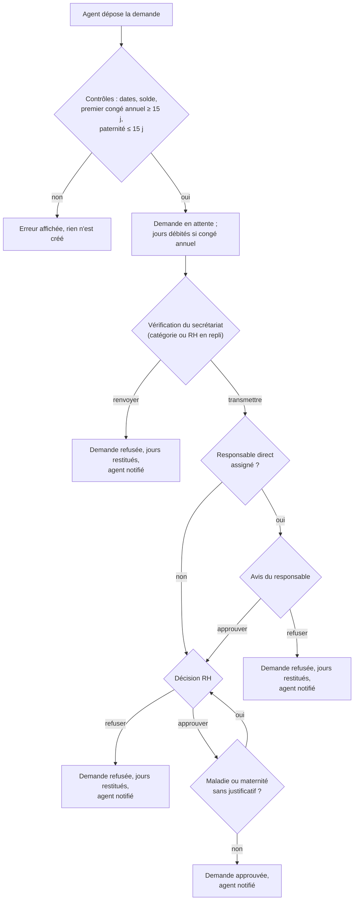
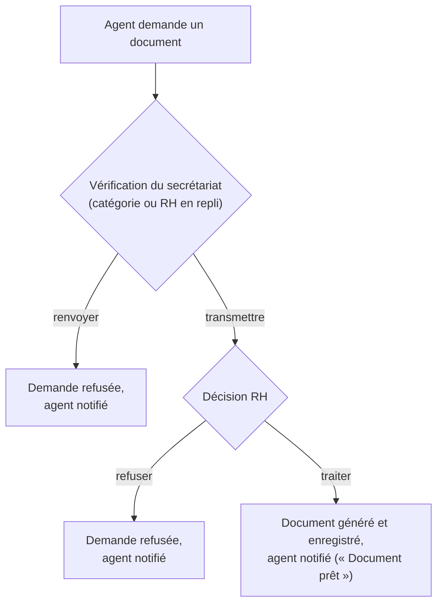

# 4. Circuits de validation et de notifications

Ce document décrit les parcours d'une demande de bout en bout : qui agit, dans quel ordre, et qui est prévenu à chaque étape. Il reflète le code au 5 octobre 2026.

## 4.1 Acteurs

- **Agent** : PE ou PAT, qui dépose la demande.
- **Secrétaire** : PAT désigné par la RH, qui vérifie la conformité des demandes de sa catégorie (PE ou PAT). Il ne décide pas du fond.
- **Responsable direct** : chef de service ou, à défaut, responsable de direction. Il donne un avis.
- **RH** : ADMIN_RH, qui décide. Il sert de repli si aucun secrétaire n'existe pour une catégorie.

## 4.2 Circuit d'une demande de congé

Points à retenir :
- Le circuit est linéaire : une étape ne peut pas être sautée, et un refus termine la demande à tout moment.
- Le solde est débité **à la création** et restitué à tout refus d'un congé annuel. Les jours ne sont jamais restitués deux fois (écritures conditionnelles dans une transaction).
- Le circuit du responsable direct est celui d'origine ; l'étape secrétariat a été ajoutée devant lui sans le modifier.

## 4.3 Circuit d'une demande de document

## 4.4 Circuit d'un compte

1. **Création** : l'agent saisit son matricule et le code de vérification. Le compte est en attente.
2. **Décision** : la RH active ou refuse le compte depuis « Comptes en attente ».
3. **Vie du compte** : le superadmin peut désigner ou retirer un secrétaire (changement de rôle), désactiver ou supprimer un compte.
4. **Suppression** : le superadmin doit d'abord avoir contacté la personne par email. Le compte passe dans la corbeille, d'où il peut être restauré.
5. **Brute-force** : 10 échecs de connexion bloquent un compte PE, PAT ou secrétaire pendant 30 minutes. Le superadmin est alors prévenu.

## 4.5 Circuit des alertes de carrière

1. Un traitement automatique (`avancementEcheanceJob`) calcule les échéances d'avancement d'échelon.
2. Une échéance échue crée une alerte **OUVERTE** dans `alertes_avancement`, et la RH est notifiée (type `echeance`).
3. La RH traite l'alerte (l'avancement est enregistré dans la carrière, l'alerte passe en **TRAITEE**) ou l'ignore (**IGNOREE**).

## 4.6 Circuit des contrats

1. Un traitement automatique (`contratEcheanceJob`) surveille les dates de fin.
2. À l'approche de la fin (délai de 6 mois), l'agent et la RH sont notifiés une seule fois (`notifie_echeance_le`).
3. À l'expiration, une notification distincte est envoyée une seule fois (`notifie_expiration_le`).

## 4.7 Table des notifications

Toutes les notifications sont enregistrées dans la table `notifications` (expéditeur, destinataire, titre, message, type, lu ou non, lien).

| Événement | Destinataire | Type | Titre |
|---|---|---|---|
| Demande de congé déposée | Secrétariat de la catégorie, et RH | `conge` | Nouvelle demande de congé à vérifier |
| Congé vérifié et transmis, avec responsable | Responsable direct | `conge` | Nouvelle demande de congé (votre équipe) |
| Congé vérifié et transmis, sans responsable | RH | `conge` | Nouvelle demande de congé |
| Congé renvoyé par le secrétariat | Agent | `conge` | Congé renvoyé par le secrétariat |
| Congé refusé par le responsable | Agent | `conge` | Congé refusé |
| Congé approuvé par le responsable | RH | `conge` | Demande de congé à valider |
| Décision RH sur un congé | Agent | `conge` | Congé approuvé / Congé refusé |
| Demande de document déposée | Secrétariat de la catégorie, et RH | `info` | Nouvelle demande de document à vérifier |
| Document vérifié et transmis | RH | `info` | Nouvelle demande de document |
| Document renvoyé par le secrétariat | Agent | `info` | Demande de document renvoyée par le secrétariat |
| Document prêt | Agent | `info` | Document prêt |
| Demande de document refusée | Agent | `info` | Demande de document refusée |
| Échéance d'avancement d'échelon | RH | `echeance` | Alerte d'avancement |
| Contrat arrive à échéance | Agent | `echeance` | Échéance de contrat approchante |
| Contrat arrive à échéance | RH | `echeance` | Contrat à traiter |
| Contrat expiré | Agent | `echeance` | Contrat expiré |
| Contrat expiré sans décision | RH | `echeance` | Contrat expiré sans décision |
| 10 échecs de connexion | Superadmin | `info` | Tentatives de connexion suspectes |

Types de notification autorisés par la base : `info`, `reunion`, `echeance`, `conge`, `paie`. Le type `reunion` est proposé à l'envoi manuel (page « Envoyer une notification ») ; le type `paie` n'est ni émis par le code ni proposé à l'envoi : il est à retirer ou à implémenter.

## 4.8 Limites actuelles

- **Pas de temps réel.** Les notifications sont récupérées à la demande ; un WebSocket est prévu au cahier des charges et n'est pas implémenté.
- **Doublons pour la RH.** Quand un secrétariat est en place, la RH reçoit une notification à la création de la demande (repli) puis une seconde à la transmission. C'est voulu pour éviter le blocage, mais à confirmer.
- **Pas de relance.** Aucune relance automatique n'est envoyée pour une demande restée en attente. Aucune n'a été trouvée dans le code.
- **Renvoi définitif.** Un renvoi par le secrétariat clôt la demande. L'agent doit en déposer une nouvelle (voir [01](01_regles_de_gestion.md), RG-C12).
