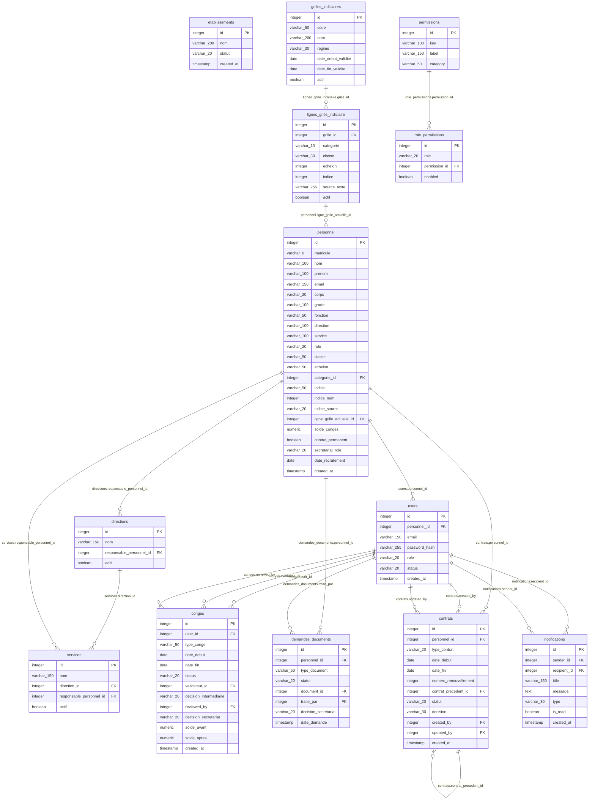

# 6. Modèle physique de données (MPD)

Traduction du [MCD](02_modele_donnees_dictionnaire.md#22-modèle-conceptuel-simplifié) en tables SQL réelles : noms de colonnes, types PostgreSQL, clés primaires et étrangères, contraintes. Généré par introspection de la base `rh_mahajanga` le 8 octobre 2026 (migrations jusqu'à la 022 incluse), pas recopié à la main.

Limité aux **13 tables du cœur métier** (personnel, comptes, organisation, congés, documents, contrats, grille indiciaire, permissions, notifications), pour rester dans un format exploitable au corps du texte. Le détail complet des 36 tables de la base reste disponible dans le [dictionnaire de données](02_modele_donnees_dictionnaire.md#24-dictionnaire-de-données) et dans `server/database/schema.sql` ; il peut être placé en annexe du mémoire.

## 6.1 Diagramme physique

*(Mermaid n'accepte pas d'espace ni de parenthèses dans les noms de type d'un bloc d'entité : `varchar_6` se lit `VARCHAR(6)`, `varchar_100` se lit `VARCHAR(100)`, etc. — à corriger en légende lisible dans la version Word, voir § 6.2.)*

## 6.2 Légende des types (pour la version Word/figure du mémoire)

| Raccourci dans le diagramme | Type PostgreSQL réel |
| --- | --- |
| `integer` | `INTEGER` |
| `varchar_N` | `VARCHAR(N)` |
| `text` | `TEXT` |
| `date` | `DATE` |
| `timestamp` | `TIMESTAMP` (sans fuseau) |
| `numeric` | `NUMERIC` |
| `boolean` | `BOOLEAN` |

## 6.3 Clés et contraintes notables

- **Toutes les clés primaires** sont des `INTEGER` auto-incrémentés (séquence PostgreSQL `nextval(...)`), sauf mention contraire.
- **Suppression** : les clés étrangères ci-dessus utilisent `CASCADE`, `SET NULL` ou `NO ACTION` selon la table (détail exact dans `server/database/schema.sql`) ; la suppression applicative passe en plus par la table `corbeille` (non représentée ici, car hors cœur métier), qui conserve une copie JSON de la ligne supprimée pour restauration.
- **Contraintes `CHECK`** (non représentées dans le diagramme, mais actives en base) : `users.role` ∈ {SUPERADMIN, ADMIN_RH, PE, PAT, MESUPRES, SECRETAIRE_PE, SECRETAIRE_PAT}, `personnel.corps` ∈ {FONCTIONNAIRE, EFA, ELD}, `conges.status` ∈ {en_attente, approuvee, refusee}, `conges.decision_secretariat` ∈ {en_attente, approuvee, refusee}, `contrats.statut` ∈ {actif, expire, resilie, ...}. Liste complète dans `docs/conception/01_regles_de_gestion.md`.
- **`personnel.direction` et `personnel.service` sont des `VARCHAR`**, pas des clés étrangères vers `directions`/`services` (voir point de vigilance n°1 du [MCD](02_modele_donnees_dictionnaire.md#23-points-de-vigilance-du-modèle)) : un écart assumé du modèle physique par rapport à ce qu'un MCD « pur » suggérerait, à mentionner explicitement dans le mémoire comme un choix documenté plutôt qu'un oubli.
- **Table hors cœur métier mais structurante** : `categories_professionnelles` (référencée par `personnel.categorie_id`) n'est pas détaillée ici ; voir le dictionnaire complet.

## 6.4 Pour la rédaction du mémoire

- Ce diagramme correspond à la section **III.7 « Modélisation du système »** du [plan de rédaction](../../client/docs/plan_redaction_memoire.md), juste après le MCD.
- Pour un rendu « boîtes » façon mémoire (une table = un rectangle avec le nom des colonnes, comme illustré dans le modèle AQUALMA), le fichier Word `docs/memoire/modele_physique_donnees.docx` reprend ces mêmes 13 tables sous forme de tableaux Word plutôt que de diagramme Mermaid (plus fiable à l'impression qu'un rendu de diagramme).
