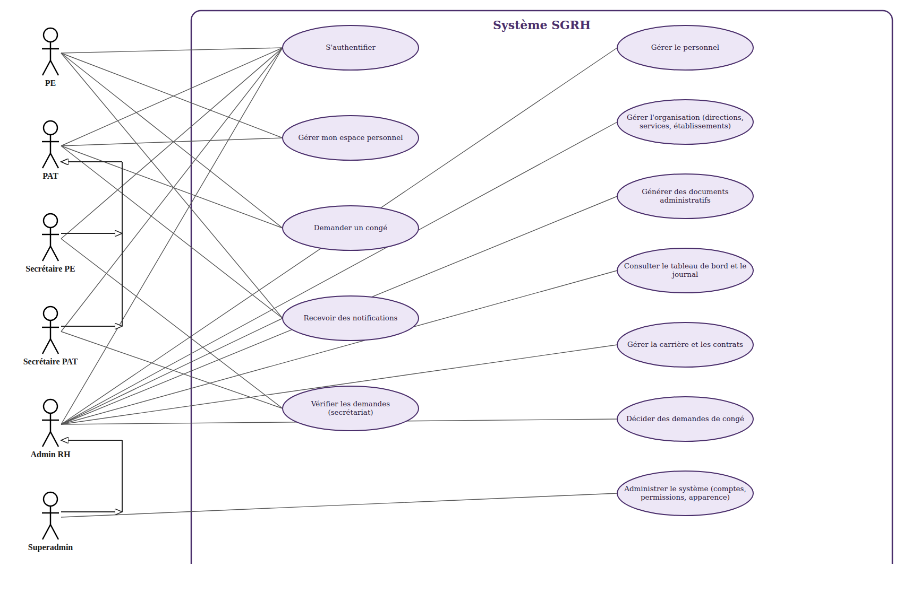

# 7. Diagramme de cas d'utilisation

Diagramme construit à partir des rôles et permissions réels du système (`docs/conception/03_matrice_roles_permissions.md`), pas inventé : chaque association acteur → cas d'utilisation correspond à une ou plusieurs permissions réellement accordées en base. Les cas d'utilisation sont regroupés par grande fonction (et non listés un par un pour les 31 permissions) pour rester lisible, à l'image de l'usage académique habituel pour ce type de diagramme.

## 7.1 Diagramme

## 7.2 Lecture du diagramme

- **6 acteurs** (les 6 rôles d'accès du système) : PE, PAT, Secrétaire PE, Secrétaire PAT, Admin RH, Superadmin.
- **Deux flèches de généralisation** (triangle creux, convention UML — « hérite de ») reflètent une règle de gestion réelle plutôt qu'une simplification graphique :
  - `Secrétaire PE` et `Secrétaire PAT` héritent de `PAT` — RG-P06 : un secrétaire est toujours un agent PAT désigné par la RH, il garde donc tout l'espace personnel d'un PAT (demander un congé, consulter ses documents, etc.) en plus de son droit de vérification.
  - `Superadmin` hérite de `Admin RH` — reflète exactement la fonction `rolesToCheck` de `permissionRepository.js`, où SUPERADMIN reçoit toutes les permissions d'ADMIN_RH sans duplication de lignes dans `role_permissions`.
- **12 cas d'utilisation**, regroupés par catégorie de permission :

| Cas d'utilisation | Acteurs directement associés | Permissions couvertes |
| --- | --- | --- |
| S'authentifier | Tous | (connexion, commun à tous les comptes) |
| Gérer mon espace personnel | PE, PAT (hérité par les secrétaires) | `view_profil`, `modifier_mes_infos`, `view_mes_documents`, `demander_document`, `signaler_probleme` |
| Demander un congé | PE, PAT (hérité par les secrétaires) | `create_conge`, `view_mes_conges` |
| Recevoir des notifications | PE, PAT, Admin RH (hérité par Superadmin et les secrétaires) | `view_notifications` |
| Vérifier les demandes (secrétariat) | Secrétaire PE, Secrétaire PAT | `review_conges_secretariat`, `review_documents_secretariat` |
| Gérer le personnel | Admin RH (hérité par Superadmin) | `create_personnel`, `view_personnel` |
| Gérer l'organisation | Admin RH (hérité par Superadmin) | `manage_organisation`, `manage_etablissements`, `manage_fonctions` |
| Générer des documents administratifs | Admin RH (hérité par Superadmin) | `manage_documents` |
| Consulter le tableau de bord et le journal | Admin RH (hérité par Superadmin) | `view_dashboard_admin`, `view_historique`, `view_pending_accounts` |
| Gérer la carrière et les contrats | Admin RH (hérité par Superadmin) | `manage_situations_administratives`, `manage_parametres_carriere`, `delete_carriere_evenement` |
| Décider des demandes de congé | Admin RH (hérité par Superadmin) | `view_conges_admin` |
| Administrer le système | Superadmin uniquement | `manage_accounts`, `manage_permissions`, `manage_corbeille`, `manage_reclamations`, `manage_site_settings`, `manage_site_texts` |

## 7.3 Simplifications assumées

- Les lignes individuelles de la matrice (31 permissions) sont regroupées en 12 cas d'utilisation lisibles ; le détail permission par permission reste dans `03_matrice_roles_permissions.md`, citable en note de bas de page ou en annexe.
- Le contrôle hors matrice (séparation des tâches pour les secrétaires, contrôle de propriété) n'est pas représentable dans un diagramme de cas d'utilisation classique ; il est documenté textuellement au § 3.4 de `03_matrice_roles_permissions.md` et doit être mentionné en prose à côté du diagramme dans le mémoire, pas uniquement dans la figure.
- `Admin RH` apparaît un cran en dessous de `Superadmin` dans la hiérarchie figurée (généralisation), mais côté base de données `ADMIN_RH` n'hérite de rien : c'est bien `SUPERADMIN` qui hérite d'`ADMIN_RH`, le sens de la flèche (enfant → parent) le reflète correctement.

## 7.4 Pour la rédaction du mémoire

- Section concernée : **III.7 « Modélisation du système »** du [plan de rédaction](../../client/docs/plan_redaction_memoire.md), avant le MCD.
- Version Word prête à coller : `docs/memoire/cas_utilisation.docx`.
- Source éditable du diagramme (pour modification ultérieure) : script `cas_utilisation.js` utilisé en session, génère un SVG rendu en PNG via Chrome headless — à régénérer si de nouveaux rôles ou permissions sont ajoutés (plutôt que retoucher l'image à la main).
